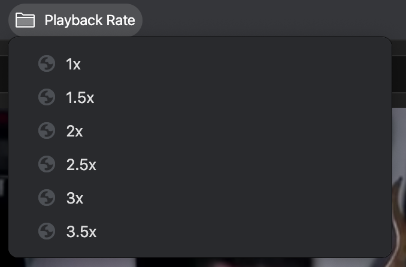

# Throttle
Control video playback rate on any website. 

### Instructions
 - [Open Extensions](chrome://extensions/) (chrome://extensions/)
 - Click 'Load unpacked extension...' 
 - Select the repository folder
 - Open folder
 - [Open Bookmarks](chrome://bookmarks/) (chrome://bookmarks/)
 - You can now remove the extension

### Firefox Instructions
 - Should work the same.
